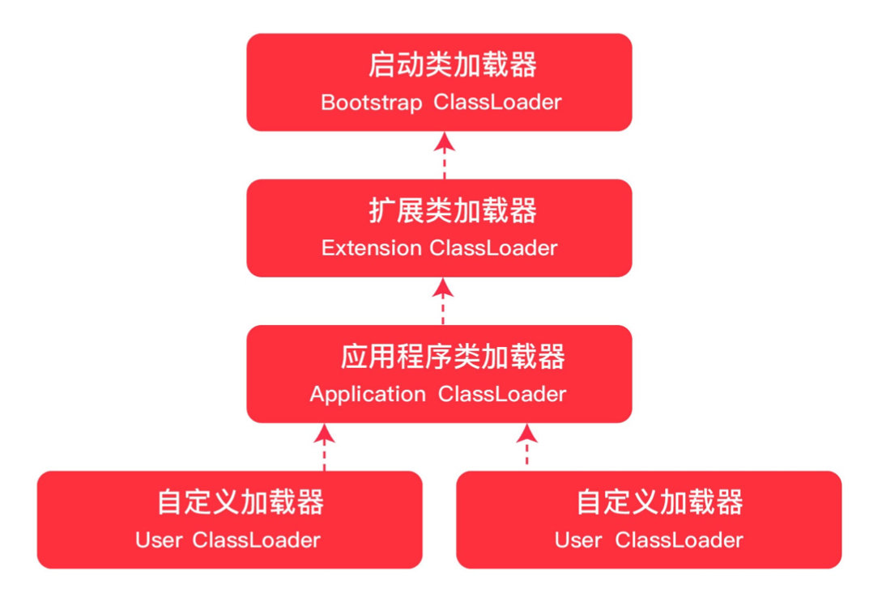
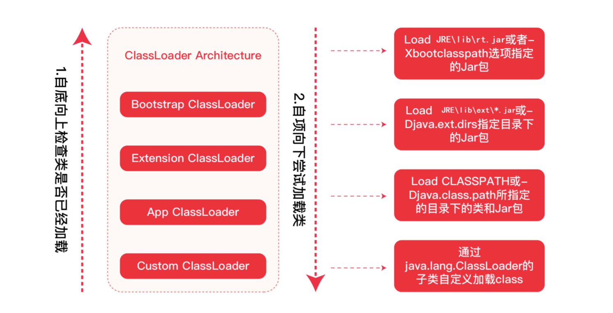
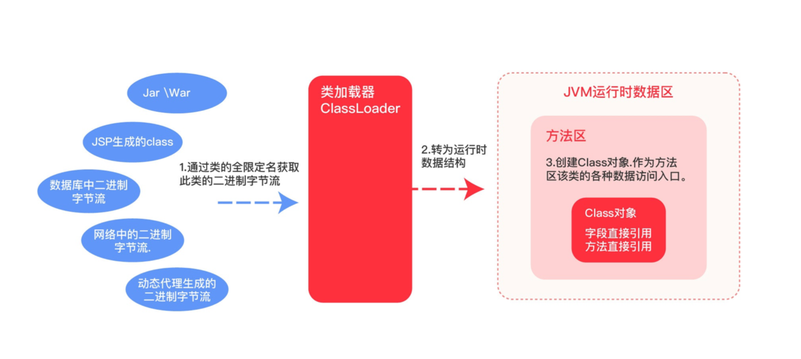
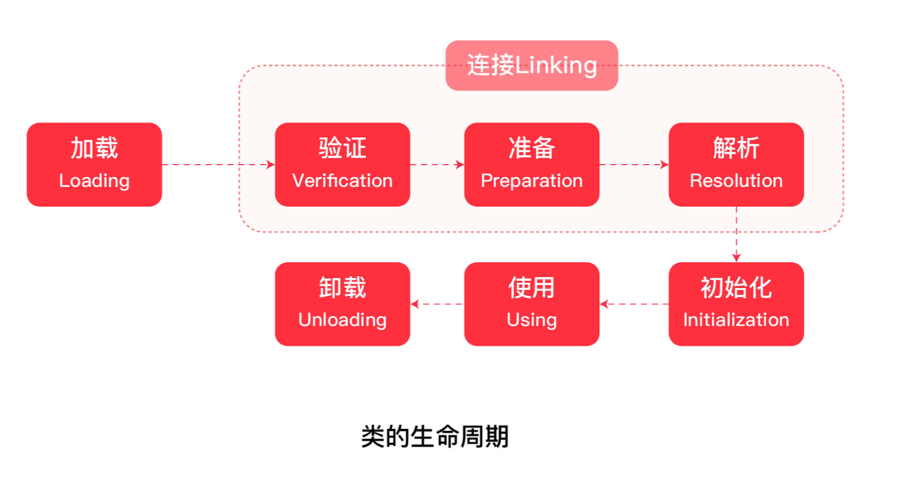

## JVM 虚拟机

> **学习 JVM 的路径**
>
> JVM 基本常识 -> 类加载子系统 -> 运行时数据区 -> 一个对象的一生 -> GC 收集器 -> 调优实战

### 1. JVM 基本常识

- 广义上指的是一种规范
- 狭义上是 JDK 中的 JVM 虚拟机
- JVM的实现是由各个厂商来做的，比如现在流传最广泛的是hotspot

- 各种硬件平台上的 Java 虚拟机实现

- JVM 架构图


- Java 和 JVM 的关系

  

### 2. 类加载子系统

> JVM 的类加载是通过 ClassLoader 及其子类来完成的

#### 2.1 类加载器



1. **Bootstrap ClassLoader 启动类加载器**

   - 负责加载 JAVA_HOME\lib 目录中的，或通过-Xbootclasspath参数指定路径中的，且被虚拟机认可(按文件名识别，如rt.jar)的类

   - 由C++实现，不是ClassLoader的子类

2. **Extension ClassLoader 扩展类加载器**
   - 负责加载 JAVA_HOME\lib\ext 目录中的，或通过java.ext.dirs系统变量指定路径中的类库

3. **Application ClassLoader 应用程序类加载器**
   - 负责加载用户路径(classpath)上的类库

4. **User ClassLoader 自定义类加载器**

   - 加载应用程序之外的类文件

   - 在汽车行驶的时候，为汽车更换轮子

   - 例如：[JRebel](https://www.jrebel.com/)



- 自底向上检查类是否被加载，只要某个classloader已加载就视为已加载此类，保证此类只所有ClassLoader加载一次

- 自定向下执行加载，由上层来逐层尝试加载此类，防篡改

#### 2.2 类加载的途径

- jar/war
- jsp 生成的 class
- 数据库中的二进制字节流
- 网络中的二进制字节流
- 动态代理生成的二进制字节流

#### 2.4 类加载的时机

- 遇到 new 、 getstatic 、 putstatic 和invokestatic 这四条指令时，如果对应的类没有初始化，则要对对应的类先进行初始化

  ```java
  public class Student{
      private static int age ;
      public static void method(){
      }
  }
  //Student.age
  //Student.method();
  //new Student();
  ```

- 使用 java.lang.reflect 包方法时对类进行反射调用的时候

  ```java
  Class c = Class.forname("com.hero.Student");
  ```

- 初始化一个类的时候发现其父类还没初始化，要先初始化其父类

- 当虚拟机开始启动时，用户需要指定一个主类(main)，虚拟机会先执行这个主类的初始化

#### 2.5 类加载的过程



- 全限定名称 -> 二进制字节流加载 class 文件
- 字节流的静态数据结构 -> 方法区的运行时数据结构
- 创建字节码 Class 对象



#### 2.6 自定义类加载器案例

1. 新建一个 User.java 类

   ```java
   public class User {
       public void print() {
           System.out.println("****User****");
       }
   }
   ```

2. 将类 copy 到目录 /Users/lishaofei/Downloads

3. 编译类：`javac User.java`

4. 自定义类加载器，继承ClassLoader，重写findClass()方法，调用defineClass()方法

   ```java
   package com.zero.snippet.jvm;
   
   import java.io.*;
   import java.lang.reflect.Method;
   
   /**
    * 自定义类加载器案例
    *
    * @author lishaofei
    * @date 2022/9/12 11:31
    */
   public class MyCustomClassLoader extends ClassLoader {
   
       private final String classpath;
   
       public MyCustomClassLoader(String classpath) {
           this.classpath = classpath;
       }
   
       public static void main(String[] args) throws Exception {
           //自定义类加载器的加载路径(事先在该目录使用同版本 jdk 编译一个 class 类，参考 model.User)
           MyCustomClassLoader myCustomClassLoader = new MyCustomClassLoader("/Users/lishaofei/Downloads");
           // 类全限定名称
           Class<?> c = myCustomClassLoader.loadClass("User");
   
           if (c != null) {
               // 创建对象
               Object obj = c.newInstance();
               // 获取对象的指定方法
               Method method = c.getMethod("print", (Class<?>[]) null);
               // 执行方法
               method.invoke(obj);
               // 打印该类的类加载器
               System.out.println(c.getClassLoader().toString());
               // 打印内容：com.zero.snippet.jvm.MyCustomClassLoader@2f2c9b19
           }
       }
   
       @Override
       protected Class<?> findClass(String name) throws ClassNotFoundException {
           try {
               // 输入流，通过类的全限定名称加载文件到字节数组
               // 将文件目录中的 class 文件，以字节码流输入内存
               byte[] classDate = getData(name);
               if (classDate != null) {
                   //defineClass方法将字节数组数据 转为 字节码对象
                   return defineClass(name, classDate, 0, classDate.length);
               }
           } catch (IOException e) {
               e.printStackTrace();
           }
   
           return super.findClass(name);
       }
   
       //加载类的字节码数据
       private byte[] getData(String className) throws IOException {
           String path = classpath + File.separatorChar +
                   className.replace('.', File.separatorChar) + ".class";
           try (InputStream in = new FileInputStream(path);
                ByteArrayOutputStream out = new ByteArrayOutputStream()) {
               byte[] buffer = new byte[2048];
               int len;
               while ((len = in.read(buffer)) != -1) {
                   out.write(buffer, 0, len);
               }
               return out.toByteArray();
           } catch (FileNotFoundException e) {
               e.printStackTrace();
           }
           return null;
       }
   
   }
   ```

5. 执行自定义类加载器的 main 方法

6. 输出结果如下

   ```java
   ****User****
   com.zero.snippet.jvm.MyCustomClassLoader@2f2c9b19
   ```

#### 2.7 双亲委派

**2.7.1 什么是双亲委派？**

当一个类加载器收到类加载任务，会先交给其父类加载器去完成。因此，最终加载任务都会传递到顶层的启动类加载器，只有当父类加载器无法完成加载任务时，子类才会尝试执行加载任务。

**2.7.2 为什么需要双亲委派？**

避免原始类被覆盖

**2.7.3 打破双亲委派**

在某些情况下，父类加载器需要加载的class文件受到加载范围的限制，无法加载到需要的文件，这 个时候就需要委托子类加载器进行加载。这种情况就打破了双亲委派模式


以Driver接口为例，Driver接口定义在JDK中，其实现由各个数据库的服务商来提供，如 MySQL、Oracle、SQLServer等等，都实现了该接口，这些实现类都是以jar包的形式放到 classpath目录下。DriverManager加载各个实现了Driver接口的实现类(在classpath下)进行 管理，但是DriverManager由启动类加载器加载，只能加载JAVA_HOME的lib下文件，而其 实现类是由服务商提供的，由系统类加载器加载。这个时候，就需要启动类加载器来 委托 子 类来加载Driver实现，这就破坏了双亲委派。

与双亲委派冲突的还有：热加载技术、Tomcat 加载多个应用程序

### 3. 运行时数据区


### 4. 一个对象的一生


### 5. GC 收集器


### 6. JVM 调优工具


### 7. 调优实战